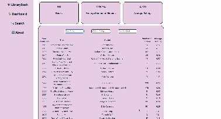

# Library Dashboard Part 1
Library Dashboard Part 1 provides an at-a-glance summary of information gathered from a public API.

Users will be able to view: 
- a summary of statistics
- a list view of the data that can be searched and filtered

**The following **required** functionality is completed:**

- [x] The site displays a list of data fetched using an API call

- [x] The useEffect() React hook and async/await syntax are used in the code

- [x] The app dashboard includes at least three summary statistics about the data

- [x] A search bar allows the user to search for an item in the fetched data

- [x] An additional filter allows the user to restrict displayed items by specified categories

**The following **optional** functionality are implemented:**
- [x] Multiple filters can be applied simultaneously

- [ ] Filters use different input types

- [x] User can enter specific bounds for filter values


# Here's how Library Dashboard Part 1 looks:



# Getting started
**Install dependencies**
```
npm install
```

**Run the application in developer mode**

```
npm run dev
```

**Open project in the browser**

In the command line Vite will display a link, such as http://127.0.0.1:5173 to click on or copy/paste that will take you to the localhost port where the project is running.

**Tip:** If you'd like to stop the server, you can use ctrl + c or cmd + c within the Terminal, or use the trash can icon in the top right of the Terminal within VS Code. To run the server again, simply use npm run dev again.
